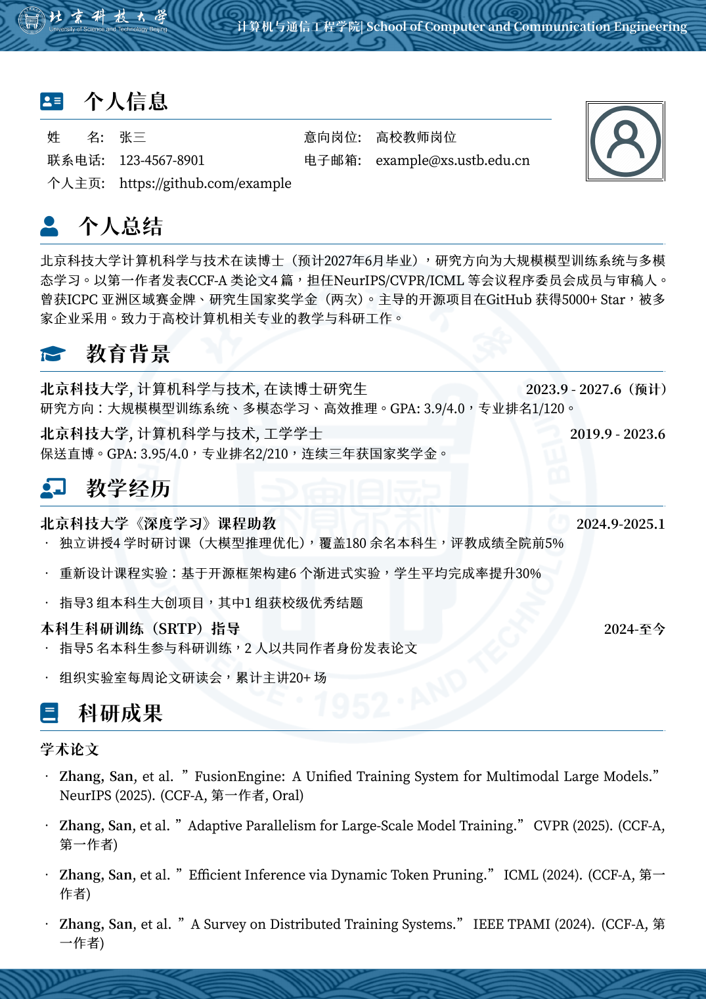

# ustb-cv-zh

北京科技大学中文简历 LaTeX 模板。



## 致谢
本模板基于[哈尔滨工业大学（威海）中文简历模板 hitwh-cv-zh](https://github.com/maohy0/hitwh-cv-zh)调整而来（其又基于[西北工业大学中文CV模板](https://www.overleaf.com/latex/templates/npu-cv/mncqzxhvfzrx)和[北京邮电大学BUPT简历模板](https://github.com/Yokumii/BUPT-CV-Template)），感谢以上模板的作者！

主题色与校徽取自[北京科技大学视觉形象识别系统](https://vi.ustb.edu.cn)（标准色"科技蓝" RGB 0, 91, 148），校徽版权归北京科技大学所有。

字体跟BUPT模板一样，用的是[狮尾四季春](https://github.com/max32002/swei-spring)，感谢max！

## 使用说明

1. 克隆本仓库到本地

2. 安装依赖：需要使用 XeLaTeX 编译，可以安装Tex Live和MikTeX，Mac用户也可以安装MacTeX；或跳过本地安装，使用[在线编译](#在线编译latex-agent推荐)

3. 修改模板：
   - 在 `main.tex` 中填写个人信息（学院、邮箱等）
   - 替换 `images\avatar.png` 为个人照片

4. 编译简历：
   ```powershell
   xelatex main.tex
   ```
   建议编译至少2遍，也可以在所在文件夹运行PowerShell脚本`buildpdf.ps1`，可以直接实现编译，以及在确认后删除编译产生的临时文件

5. 查看结果：
   - 生成的 PDF 文件为 `main.pdf`

## 在线编译：LaTeX Agent（推荐）

不想配置本地 TeX 环境？把本模板上传到 [LaTeX Agent](https://latex-agent.sun-praise.com) 即可在浏览器里完成编译：

- **云端编译 + 实时预览**：打开浏览器即可使用，无需安装 TeX Live / MiKTeX
- **AI 辅助**：编译报错自动诊断与修复，AI 助手帮你改简历
- **版本管理与协作**：Git 版本追踪、导师/伙伴在线批注评审
- **Agent 直连（MCP）**：你的 AI 助手可以接管编译-修改-迭代全流程

注册即享 7 天试用，到期自动降级为免费计划，无需手动取消。

> 声明：本模板的北科大适配由 LaTeX Agent 作者完成，欢迎试用。
